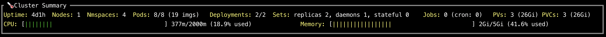

# ktop

<h1 align="center">
    
</h1>

A `top`-like tool for your Kubernetes cluster.

Following the tradition of Unix/Linux `top` tools, `ktop` is a tool that displays useful metrics information about nodes, pods, and other workload resources running in a Kubernetes cluster.

## Features

* Insightful summary of cluster resource metrics
* Ability to work with or without a metrics-server deployed
* Displays nodes and pods usage metrics when a Metrics Server is found
* Uses your existing cluster configuration to connect to a cluster's API server

## Installing ktop

### kubectl `ktop` plugin

Project `ktop` is distributed as a kubectl plugin.  To use ktop as a plugin do the followings:

* [Install](https://krew.sigs.k8s.io/docs/user-guide/setup/install/) `krew` plugin manager (if not present)
* Ensure ktop is available to be installed: `kubectl krew search ktop`
* Next, install the plugin: `kubectl krew install ktop`

Once installed, start the ktop plugin with

```
kubectl ktop
```

### Homebrew installation
`ktop` is also available via the `brew` package manager. 

#### OSX / Linux

```
brew tap vladimirvivien/oss-tools
brew install ktop
```

### Using a container
The binary is relased as an OCI container at `ghcr.io/vladimirvivien/ktop`.
If you have a container runtime installed (Docker for instance), you launch ktop as shown below:

```
export KUBECONFIG=/home/user/.kube/config
docker run --network=host --rm --platform="linux/arm64" -it -v $KUBECONFIG:/config -e KUBECONFIG=/config -e TERM=xterm-256color ghcr.io/vladimirvivien/ktop:latest
```

### Using `go install`

If you have a recent version of Go installed (1.14 or later) you can build and install ktop as follows:

```
go install github.com/vladimirvivien/ktop@latest
```

This should place the ktop binary in your configured `$GOBIN` path or place it in its default location, `$HOME/go/bin`.

### Download binary

Another easy way to get started with ktop is to download the pre-built binary directly (for your system):

> https://github.com/vladimirvivien/ktop/releases/latest

Then, extract the ktop binary and copy it to your system's execution path.


### Build from source

Download or clone the source (from GitHub). From the project's root directory, do the following:

```
go build .
```

The project also comes with a Go program that you can use for cross-platform builds.
```
go run ./ci/build.go
```

## Running ktop

With a locally accessible kubeconfig file on your machine, ktop can be executed simply:

```
ktop
```

The previous command will use either environment variable `$KUBECONFIG` or the default path for the kubeconfig file. The program currently accepts the following arguments:

```
Usage:
  ktop [flags]

Flags:
  -A, --all-namespaces                 If true, display metrics for all accessible namespaces
      --as string                      Username to impersonate for the operation. User could be a regular user or a service account in a namespace.
      --as-group stringArray           Group to impersonate for the operation, this flag can be repeated to specify multiple groups.
      --as-uid string                  UID to impersonate for the operation.
      --cache-dir string               Default cache directory (default "${HOME}/.kube/cache")
      --certificate-authority string   Path to a cert file for the certificate authority
      --client-certificate string      Path to a client certificate file for TLS
      --client-key string              Path to a client key file for TLS
      --cluster string                 The name of the kubeconfig cluster to use
      --context string                 The name of the kubeconfig context to use
  -h, --help                           help for ktop
      --insecure-skip-tls-verify       If true, the server's certificate will not be checked for validity. This will make your HTTPS connections insecure
      --kubeconfig string              Path to the kubeconfig file to use for CLI requests.
  -n, --namespace string               If present, the namespace scope for this CLI request
      --request-timeout string         The length of time to wait before giving up on a single server request. Non-zero values should contain a corresponding time unit (e.g. 1s, 2m, 3h). A value of zero means don't timeout requests. (default "0")
  -s, --server string                  The address and port of the Kubernetes API server
      --tls-server-name string         Server name to use for server certificate validation. If it is not provided, the hostname used to contact the server is used
      --token string                   Bearer token for authentication to the API server
      --user string                    The name of the kubeconfig user to use```
```

For instance, the following will show cluster information for workload resources associated with namespace `my-app` in context `web-cluster` using the default kubconfig file path:

```
ktop --namespace my-app --context web-cluster
```

## ktop metrics

The ktop UI provides several metrics including a high-level summary of workload components installed on your cluster:

<h1 align="center">
    
</h1>

### Usage metrics from `metrics-server`

ktop can display metrics with or without Metrics Server present.  When a cluster has an instance of a [kubernetes-sigs/metrics-server](https://github.com/kubernetes-sigs/metrics-server) installed (and properly configured), ktop will automatically discover the server as shown:

<h1 align="center">
    
</h1>

With the metrics server installed, ktop will display resource utilization metrics as reported by the Metrics Server.

### Request/limit metrics

When there is no Metrics Server present in the cluster, ktop will still work:

<h1 align="center">
    
</h1>

Instead of resource utilization, ktop will display resource requests and limits for nodes and pods.

## Known issue
For ktop to work properly, the user account that is used (from the Kubernetes config) must have access rights to the following API objects, and their metrics: 

* Nodes (and metrics)
* Pods (and metrics)
* Deployments,
* PV, PVCs
* {Replica|Daemon|Stateful}Sets
* Jobs


When your Kubernetes user account does not have proper access rights,  you will see warning printed on the terminal, similar to the followings:

```
W0110 10:27:25.315399    1062 reflector.go:324] pkg/mod/k8s.io/client-go@v0.23.1/tools/cache/reflector.go:167: failed to list *unstructured.Unstructured: the server could not find the requested resource
E0110 10:27:25.315485    1062 reflector.go:138] pkg/mod/k8s.io/client-go@v0.23.1/tools/cache/reflector.go:167: Failed to watch *unstructured.Unstructured: failed to list *unstructured.Unstructured: the server could not find the requested resource
W0110 10:27:26.719264    1062 reflector.go:324] pkg/mod/k8s.io/client-go@v0.23.1/tools/cache/reflector.go:167: failed to list *unstructured.Unstructured: the server could not find the requested resource
E0110 10:27:26.719345    1062 reflector.go:138] pkg/mod/k8s.io/client-go@v0.23.1/tools/cache/reflector.go:167: Failed to watch *unstructured.Unstructured: failed to list *unstructured.Unstructured: the server could not find the requested resource
```

### What to do

`ktop` supports many additional CLI arguments to help you connect properly. You can set the following
arguments to adjust your connection parameters:

* `--context` - context for cluster
* `--user` - a user with proper access rights
* `--as-{uid/group}` - if impersonating a different account

There are many other arguments that may be configured to create a successful connection to the API server.
See the full list of CLI arguments in the *Running ktop* section above.

## Roadmap

* A multi-page UI to display metrics for additional components
* Display OOM processes
* Additional installation methods (Homebrew, linux packages, etc)
* Etc
