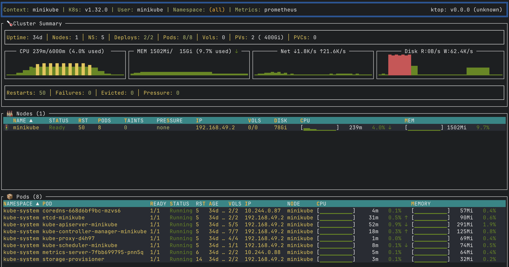

# ktop

<h1 align="center">
    
</h1>

A `top`-like tool for your Kubernetes cluster.

Following the tradition of Unix/Linux `top` tools, `ktop` is a tool that displays useful metrics information about nodes, pods, and other workload resources running in a Kubernetes cluster.

## Features

* **Real-Time Monitoring** - Continuously updated view of nodes, pods, and containers
* **Drill-Down Navigation** - Explore from cluster overview → node → pod → container logs
* **Zero Cluster Installation** - Runs locally using your kubeconfig; no agents or server-side components
* **Works Anywhere kubectl Works** - Connects through the Kubernetes API; no direct node access required
* **Streaming Container Logs** - Real-time logs with filtering, timestamps, line wrap, and full-screen mode
* **Multiple Metrics Sources** - Support Prometheus for enhanced metrics, Metrics-Server, or no-metrics as fallback
* **Graceful Degradation** - Works even without metrics infrastructure by showing resource requests/limits
* **Single Binary** - Download and run; no dependencies beyond a valid kubeconfig

## Installation

### kubectl plugin (recommended)

```bash
kubectl krew install ktop
kubectl ktop
```

Requires [krew](https://krew.sigs.k8s.io/docs/user-guide/setup/install/) plugin manager.

### Homebrew

```bash
brew tap vladimirvivien/oss-tools
brew install ktop
```

### Go install

```bash
go install github.com/vladimirvivien/ktop@latest
```

### Binary download

Download from [GitHub Releases](https://github.com/vladimirvivien/ktop/releases/latest).

## Quick Start

With a valid kubeconfig file (`$KUBECONFIG` or `~/.kube/config`):

```bash
# Start ktop with default settings
ktop

# Use a specific context
ktop --context my-cluster

# Filter to a namespace
ktop --namespace production

# Use Prometheus for enhanced metrics
ktop --metrics-source=prometheus
```

## Documentation

| Document | Description |
|----------|-------------|
| [User Guide](docs/user-guide.md) | Complete documentation: CLI reference, metrics configuration, navigation |
| [Prometheus Integration](docs/prom.md) | Enhanced metrics from kubelet/cAdvisor endpoints |
